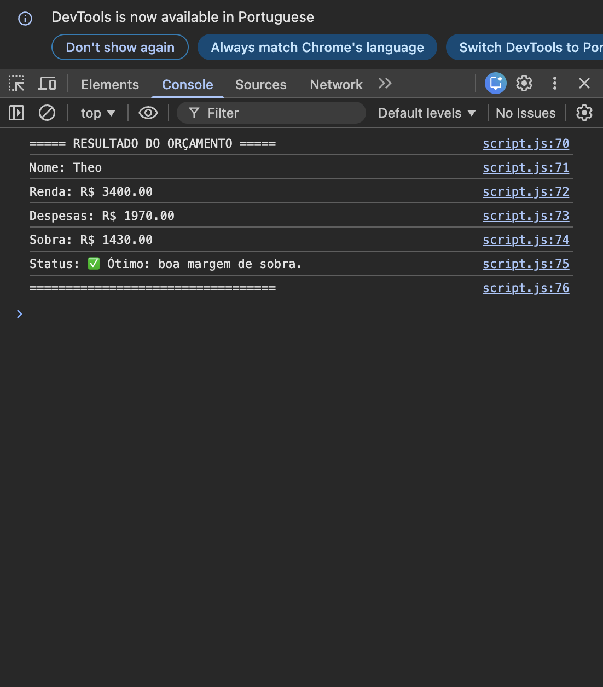

# Simulador de Orçamento Pessoal

Nome: Theo Goulart Cardoso Vasconcelos  
Matrícula: 907916

## Descrição

Este projeto simula um controle simples de orçamento pessoal utilizando JavaScript.

O usuário informa:

- Nome
- Renda mensal
- Despesas

O sistema calcula e classifica a situação financeira.

## Tecnologias

- HTML
- JavaScript

## Execução

